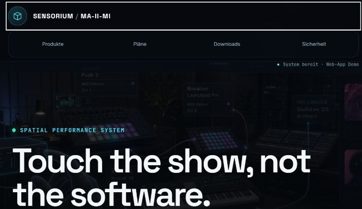
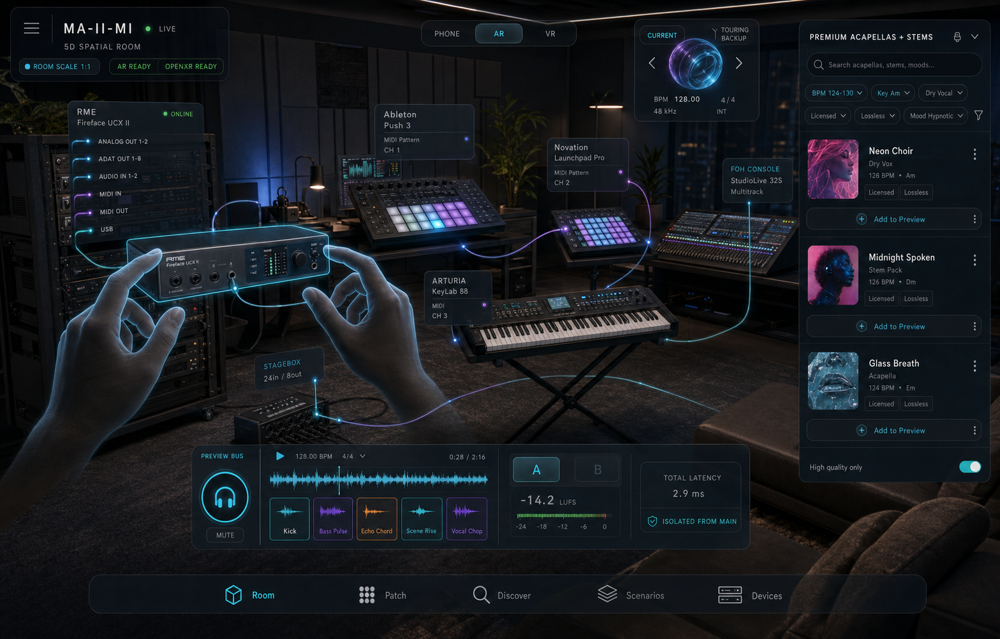
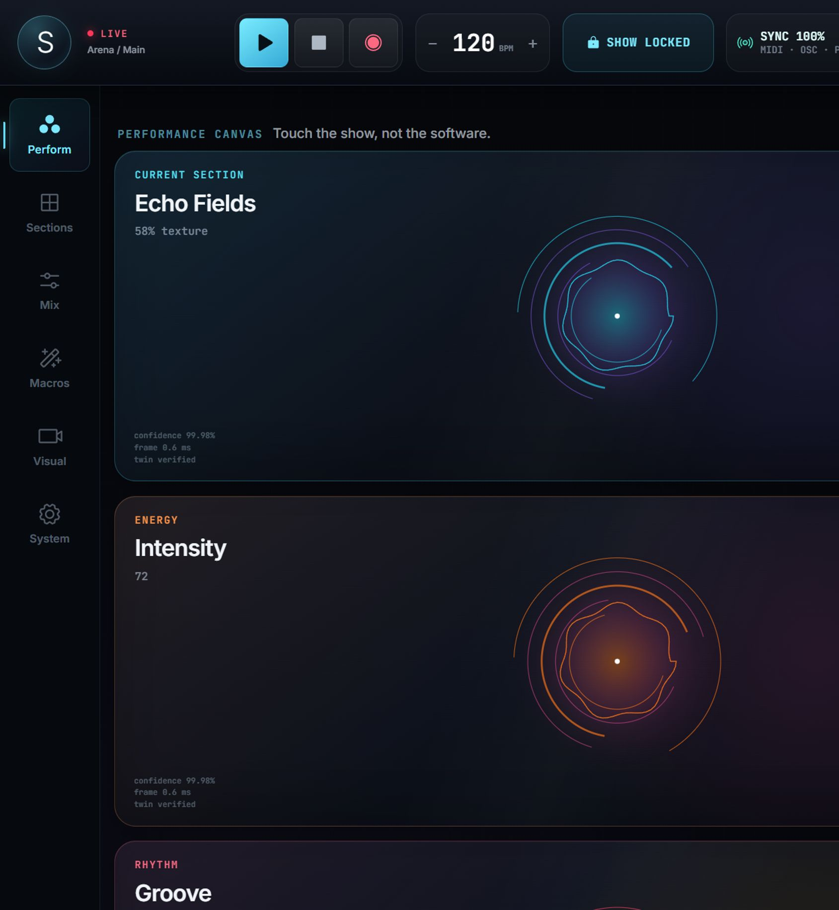
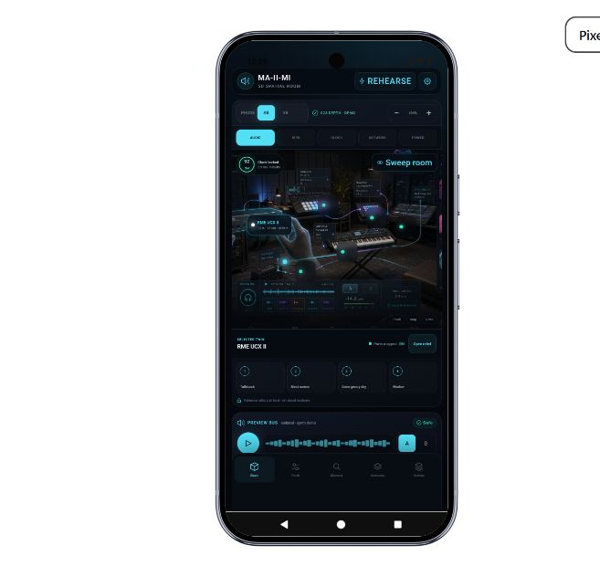
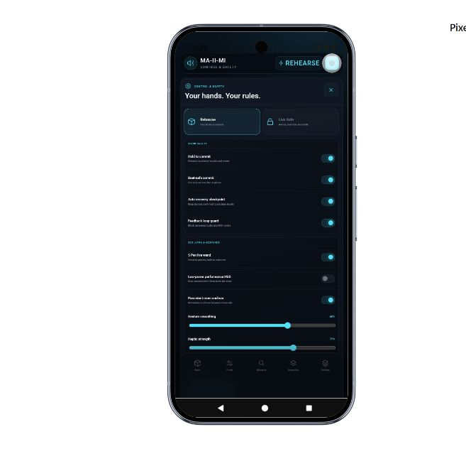
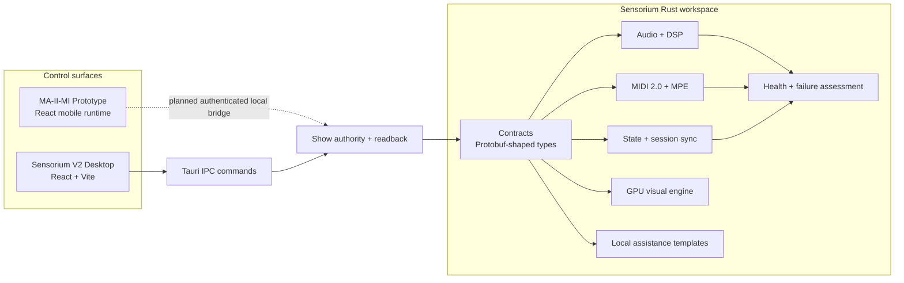

<div align="center">

# SENSORIUM

### Touch the show, not the software.

**A performance-control environment for live producers, artists, FOH engineers, and complex touring systems.**

`Desktop Performance Canvas` · `MA-II-MI Companion` · `Rust Real-Time Core` · `MIDI 2.0` · `Spatial Control`

</div>



<p align="center"><sub>The current Sensorium Spatial Gallery web design, reproduced directly in this README. GitHub READMEs are static, so the working navigation, plan finder, checkout demo, and release manifest remain part of the web app rather than the image.</sub></p>

<div align="center">

### Preview and release status

**No public binary release is currently available.** The [GitHub Releases page](https://github.com/designico5/sensorium/releases) is intentionally the source of truth and remains empty until a signed, reproducible artifact has passed the stage-test matrix. The local browser previews are documented below; a local debug APK may exist in a developer checkout, but it is not a production download.

<sub>Do not disable Windows Defender, Android Play Protect, or host firewalls. macOS DMG and iOS IPA are not offered until they can be built, signed, notarized, and tested on Apple tooling.</sub>

</div>

<details>
<summary>Spatial MA-II-MI room concept</summary>



<p align="center"><sub>The equipment, signals, catalog items, telemetry, AR state, and performance values shown here are illustrative—not live hardware readback.</sub></p>

</details>

---

## What Sensorium is

Sensorium is an experimental show-control platform designed around a simple idea: during a performance, the operator should manipulate **musical intent and show state**, not hunt through software panels.

The repository brings three layers together:

- **Sensorium V2 Desktop** — a high-density, touch-first performance surface for sections, mix, macros, visuals, and system state.
- **MA-II-MI** — a mobile companion prototype for rehearsing patches, auditioning cues, exploring licensed-content concepts, and walking through a spatial device room.
- **Sensorium Core** — a modular Rust workspace for audio/DSP, MIDI 2.0, synchronized state, GPU visuals, local assistance, contracts, health assessment, and release tooling.

Sensorium targets the demands of hybrid electronic performance, large-format live production, and touring rigs where audio, MIDI, visuals, clock, network, and recovery state must remain understandable under pressure.

> [!IMPORTANT]
> This is an active research and development codebase—not a certified live-show product. Hardware status, room scanning, AR/VR, catalog entries, and several synchronization values in the current interfaces are explicitly simulated. Validate every path independently before using any component near production equipment.

## Current state at a glance

| Area | Current state | What that means |
|---|---|---|
| Desktop Performance Canvas | **Interactive frontend prototype** | Transport, show lock, performance surfaces, undo, safety controls, and existing workspaces are usable in the browser. |
| MA-II-MI | **Interactive mobile web prototype** | Room, Patch, Discover, Scenarios, Devices, and extensive personal/safety settings run inside the Pixel/iPhone preview runtime. |
| Rust core | **Implemented modular foundation** | Audio/DSP, MIDI, sync, visual, contracts, AI templates, health, and release crates exist with unit/integration/benchmark coverage in the workspace. |
| Desktop shell | **Tauri integration scaffold** | IPC commands and the native shell exist; packaging and end-to-end hardware validation remain separate release work. |
| Native Android | **Installable debug preview** | A native Jetpack Compose APK provides Room, Patch, Audition, and release-status flows. It is debug-signed for local installation, uses a separate `.debug` package ID, and does not yet include ARCore depth, S Pen services, or production hardware readback. |
| 3D / AR / VR | **Design target + simulated interaction** | Phone/AR/VR modes, room sweep, spatial layers, anchors, and device hotspots demonstrate the interaction model; native tracking is not connected. |
| Discovery library | **Fictional demo catalog** | Acapella, MIDI, multitrack, and stem entries demonstrate UX only. No commercial catalog or licensing backend ships here. |

## The experience

### Sensorium V2 Desktop



<p align="center"><sub>4K prototype capture. All telemetry and confidence values in this screen are demonstration data.</sub></p>

The Desktop Performance Canvas is built for large displays, multitouch surfaces, and low-attention operation:

- Live transport with play/pause, stop, recording, tempo, and an armed two-step panic action.
- A **Show Lock** that protects structural and calibration controls while performance gestures remain available.
- Six musical touch surfaces covering section texture, transition preview, energy, depth, groove, and visual intensity.
- Pointer capture, drag, pinch, keyboard-accessible sliders, haptic feedback where supported, gesture undo, and safe cancellation on focus loss.
- Artist Guardian recovery control and an adaptive state-graph presentation.
- Lazy-loaded workspaces for Sections, Mix, Macros, Visuals, and System audit.
- Responsive layouts for Full HD through 4K/8K-class canvases, with reduced animation and canvas pixel-density limits at extreme resolutions.
- Reduced-motion support and semantic labels for primary interactive controls.
- Demo telemetry marked as `SIM`, `MODEL`, or `DEMO` so a prototype value is never presented as verified hardware truth.

### MA-II-MI mobile companion

<table>
  <tr>
    <td width="50%" align="center"></td>
    <td width="50%" align="center"></td>
  </tr>
  <tr>
    <td align="center"><sub>Spatial room, context layers, device selection, and isolated demo audition</sub></td>
    <td align="center"><sub>Personal overlay, show safety, S23-oriented gesture, touring, privacy, and audition settings</sub></td>
  </tr>
</table>

MA-II-MI turns the phone into a rehearsal and decision surface before anyone reaches behind a rack:

- **Room** — pan and pinch through a spatial device scene; switch between Phone, AR, and VR presentation modes.
- **Context layers** — inspect Audio, MIDI, Clock, Network, and Power as separate semantic overlays.
- **Room sweep simulation** — rehearse the S23 Ultra capture flow and select device hotspots without claiming native tracking.
- **Patch** — stage a local route diff, audition it, hold to commit, and roll back to the previous simulated state.
- **Discover** — search fictional Acapella, MIDI, Multitrack, and Stem catalogs with high-quality/licensing-oriented metadata.
- **Audition deck** — hear generated Web Audio demo tones on an isolated preview concept with A/B and headroom controls.
- **Scenarios** — prepare room-arrival, performance, dropout, and recovery scenes; morph and quantize a simulated recall.
- **Devices** — compare expected and seen topology concepts while keeping generic device twins clearly labelled as demos.
- **Live Safe** — separate rehearsal freedom from armed actions and single-writer authority concepts.
- **Personal controls** — role home, stage preset, left/right one-hand dock, calm mode, haptic strength, and gesture smoothing.
- **Touring controls** — offline show-pack, thermal fallback, camera budget, freshness hard-stop, and control authority settings.
- **Privacy controls** — local private analysis by default and separate, revocable model-training consent that defaults to off.

Settings are stored locally in the browser prototype. They do not yet configure Android services or production hardware.

## Product principles

1. **Truth before spectacle** — unknown, stale, generated, and simulated data must look different from verified readback.
2. **Preview before commit** — every consequential change should be audible, visible, and reversible before it reaches a live path.
3. **One authority at a time** — desktop, phone, or hardware may own a write transaction; the others observe until authority changes.
4. **Musical intent over technical plumbing** — transitions, energy, depth, and recovery should be first-class controls.
5. **Fail closed** — uncertainty removes write authority; it does not invent a healthy state.
6. **The main output is sacred** — discovery and audition flows belong on an isolated preview path.
7. **Offline is a show feature** — topology, scenes, recovery checkpoints, and licensed local assets must survive a lost network.
8. **Accessibility is operational safety** — large targets, keyboard control, reduced motion, stage contrast, and one-hand layouts are not optional polish.

## Architecture



### Repository map

| Path | Purpose |
|---|---|
| `sensorium-v2/packages/frontend/` | Active Sensorium V2 React/Vite Desktop Performance Canvas. |
| `sensorium-v2/apps/ma-ii-mi-prototype/` | Interactive MA-II-MI mobile web prototype and protected device-preview runtime. |
| `sensorium-v2/apps/ma-ii-mi-android/` | Native Jetpack Compose MA-II-MI debug preview for Android 8+ devices. |
| `sensorium-v2/crates/sensorium-audio/` | Audio plugin surface, DSP graph, metering, and neural-audio abstractions. |
| `sensorium-v2/crates/sensorium-dsp/` | DSP graph types, musical transport, modulation, and scratch-memory arena. |
| `sensorium-v2/crates/sensorium-midi/` | UMP parsing/routing, MPE, MIDI learn, panic messages, and network transport experiments. |
| `sensorium-v2/crates/sensorium-sync/` | Shared document, session/clip state, and repository synchronization. |
| `sensorium-v2/crates/sensorium-visual/` | Audio-to-visual parameters and GPU compute structures. |
| `sensorium-v2/crates/sensorium-ai/` | Local assistance configuration and template inference. |
| `sensorium-v2/crates/sensorium-chaos/` | Health checks, experiment runner, and failure-risk assessment. |
| `sensorium-v2/crates/sensorium-contracts/` | Shared contract types for audio, MIDI, state, visual, and local-AI domains. |
| `sensorium-v2/src-tauri/` | Tauri desktop shell and IPC command bridge. |
| `sensorium-v2/specs/` | OpenAPI and protocol contract sources. |
| `sensorium-v2/evals/` | Capability and production-readiness evaluation definitions. |
| `sensorium-harness/` | Experimental multi-agent engineering and verification harness. |
| `src/`, `src-tauri/` | Earlier Sensorium bridge/UI implementation retained alongside V2. New product work currently targets `sensorium-v2/`. |

## Quick start

### Prerequisites

- Node.js 20 or newer and npm.
- A modern Chromium-based browser for the interactive previews.
- Rust stable and platform build tools only if you want to build the Rust/Tauri workspace.
- Android Studio and JDK 17 are required only when rebuilding the native MA-II-MI APK; neither is required for the browser prototype or direct APK installation.

### 1. Run Sensorium V2 Desktop

From the repository root:

```powershell
cd sensorium-v2
npm ci
npm --workspace @sensorium/frontend run dev -- --host 127.0.0.1 --port 5173
```

Open **[http://localhost:5173](http://localhost:5173)**.

### 2. Run MA-II-MI

In a second terminal, from the repository root:

```powershell
cd sensorium-v2/apps/ma-ii-mi-prototype
npm ci
npm run check:runtime
npm run dev -- --host 127.0.0.1 --port 5174
```

Open **[http://localhost:5175](http://localhost:5175)** and select the Android device frame from the preview menu.

### 3. Build and verify the frontends

```powershell
cd sensorium-v2
npm --workspace @sensorium/frontend run build

cd apps/ma-ii-mi-prototype
npm run build
npm run test:sites
```

The MA-II-MI runtime integrity check is part of both `dev` and `build`. If it fails, repair the protected runtime instead of bypassing the check.

### 4. Check the Rust workspace

```powershell
cd sensorium-v2
cargo check --workspace
cargo test --workspace
cargo clippy --workspace -- -D warnings
```

Rust builds may require the normal OS-native audio/GPU toolchain and can take substantially longer than the frontend previews.

## Safety and security model

Sensorium is being designed for a hostile operational environment: accidental touches, stale devices, network loss, heat, broken cables, conflicting controllers, and an operator who has no spare attention.

- Live-affecting actions should require explicit authority, arming, and confirmation.
- Rehearsal actions stay local until a production readback path exists.
- A staged diff and rollback checkpoint precede commit-oriented interactions.
- Feedback-loop prevention and output headroom are modeled as policy, not decoration.
- The mobile prototype keeps preferences local and model-training consent disabled by default.
- No secret, API key, catalog credential, or device credential belongs in source control. Use local environment configuration when an integration is introduced.
- Do not disable Windows Defender, Android Play Protect, or host firewalls to run the project. Use signed artifacts and narrowly scoped local-network permissions when native distribution is added.

## Research-backed roadmap

The next product stages focus on gaps repeatedly encountered in professional live-production workflows and on interoperable industry primitives:

### Show-state authority

- Build a verified semantic show graph covering Audio, MIDI, Clock, Network, Power, Visuals, and control ownership.
- Add expected-versus-seen topology checks, freshness limits, conflict detection, and explicit unknown states.
- Make patch changes transactional: stage → validate → audition → quantize → commit → verify → roll back.

### Device twins and spatial operation

- Ingest owner-supplied front/back/port photos, labels, manuals, and optional scans before claiming an exact device twin.
- Add native Galaxy S23 Ultra room capture with persistent anchors and a low-power 2D fallback.
- Prepare shared spatial semantics for ARCore and OpenXR without coupling show authority to a headset.
- Support hand/S Pen preview gestures while keeping consequential writes bounded and confirmable.

### Audio and discovery

- Create a genuinely isolated audition bus with loudness normalization, headroom policy, tempo sync, latency estimates, and A/B routing.
- Design a licensable discovery layer for high-quality acapellas, stems, MIDI, MPE performances, and full-song multitracks.
- Keep rights, territory, offline-cache permissions, attribution, and expiration visible at the moment of use.
- Support user-owned uploads and explicitly licensed catalogs; do not build around unauthorized stems or multitracks.

### Interoperability and resilience

- Continue MIDI 2.0/UMP, MPE, MIDI-CI/Property Exchange, OSC, PTP, AES67/Milan, ADM/ADM-OSC, and WebTransport research where each protocol fits the actual layer.
- Add active/standby show-state replication, flight-recorder timelines, deterministic rescue scenes, and offline show packs.
- Measure real callback latency, packet loss, clock drift, thermal behavior, and recovery time on representative touring hardware.

## Development status and boundaries

The repository deliberately contains both working code and forward-looking experiments. Before describing a capability as production-ready, require all of the following:

1. A real input or hardware readback path—not only a generated UI value.
2. A failure path with an observable unknown/error state.
3. Automated tests at the relevant boundary.
4. Measured performance on the target device.
5. A reversible rollout and recovery procedure.
6. Clear licensing and privacy behavior for any external content or service.

For current engineering notes, see [`Status.md`](Status.md) and [`sensorium-v2/STATUS_ANALYSIS.md`](sensorium-v2/STATUS_ANALYSIS.md). These files capture different historical snapshots and may disagree; the current code, tests, and build configuration remain the source of truth.

## Contributing

This project does not yet publish a general third-party contribution agreement. If you have authorization to work on the repository:

1. Keep changes scoped to one subsystem.
2. Preserve truthful `SIM`/`DEMO`/`PLANNED` labels.
3. Add or update tests for behavior changes.
4. Run the relevant frontend and/or Rust checks above.
5. Never add credentials, commercial audio, unreleased artist material, or unlicensed device imagery.
6. Document any change that alters control authority, recovery, synchronization, privacy, or licensing behavior.

## License status

The repository-level [`LICENSE`](LICENSE) and root package metadata declare this project **proprietary and All Rights Reserved**. No general permission to copy, modify, or distribute the repository is granted there.

Some nested Rust crates currently contain `MIT OR Apache-2.0` package metadata. That is inconsistent with the repository-level notice and should be clarified by the owner before any third-party use or distribution. Do not assume a nested manifest grants permission for the repository as a whole.

---

<div align="center">

**SENSORIUM** · One show. One truth. Every surface.

Created by Nico Maedler · 2026

</div>
